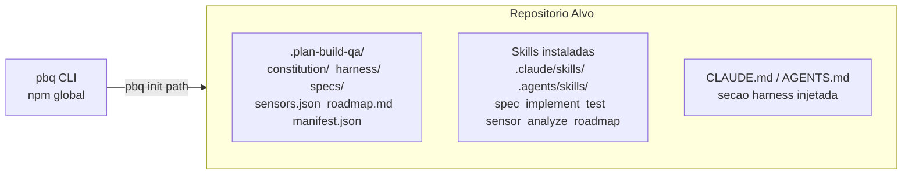
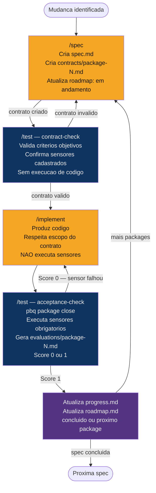
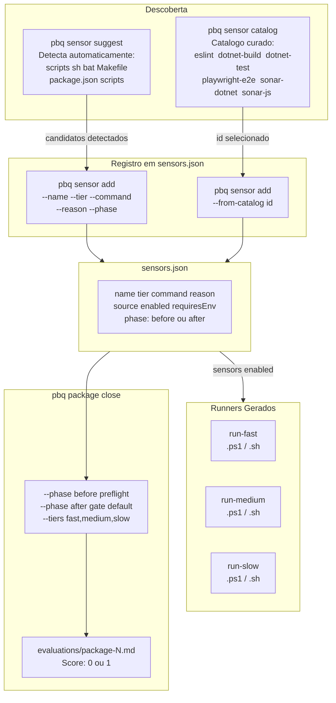
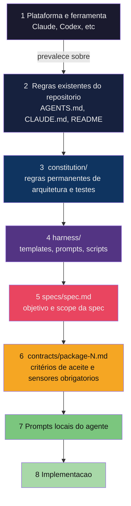

# pbq — Visão Geral do Framework

Diagramas de referência rápida do **Plan Build QA harness**.

---

## O que `pbq init` instala

---

## Pipeline das 5 Etapas

> **Laranja** = acao manual do agente/usuario. **Azul** = disparado automaticamente pelo passo anterior.

**O que e automatico:**
- `/spec` dispara `/test contract-check` logo apos criar o contrato (etapa 2 e automatica)
- `/implement` delega para `/test acceptance-check` ao terminar o codigo (etapa 4 e automatica)
- As atualizacoes de `progress.md` e `roadmap.md` fazem parte do workflow da skill ativa

**O que e manual:**
- O usuario invoca `/spec` para iniciar ou avançar uma spec
- O usuario invoca `/implement` para codificar o package
- Bypass documentado: `skip test` desabilita a delegacao automatica ao test

---

## Ecossistema de Sensores

---

## Hierarquia de Regras

