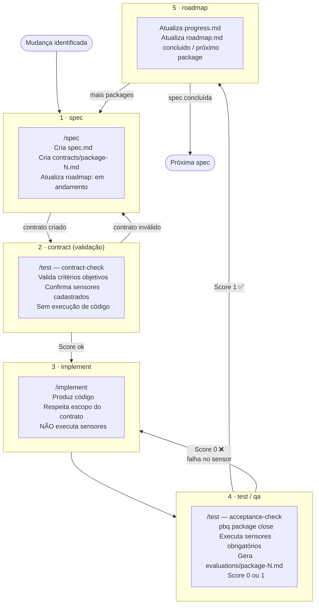
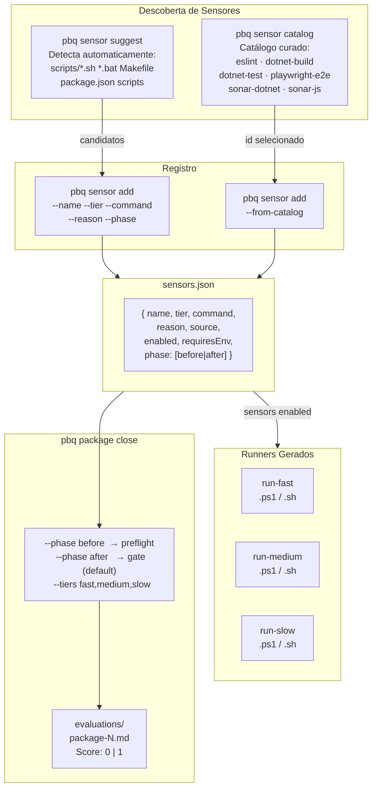
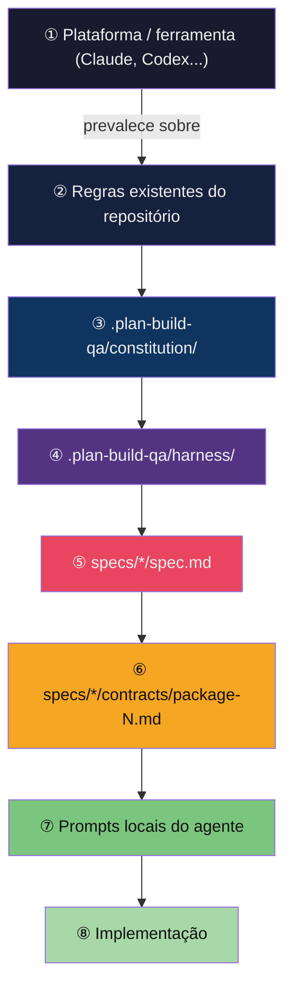

# pbq — Visão Geral do Framework

Diagramas de referência rápida do **Plan Build QA harness**.

---

## Visão Geral — O que `pbq init` instala

```mermaid
flowchart LR
    CLI["🛠️ pbq CLI\n(npm global)"] -->|pbq init [repo]| TR["📁 Repositório Alvo"]

    subgraph TR["📁 Repositório Alvo"]
        direction TB
        H["📂 .plan-build-qa/\n  constitution/    ← regras permanentes\n  harness/         ← templates, scripts, prompts\n  specs/           ← specs + contracts + evaluations\n  sensors.json     ← sensores cadastrados\n  roadmap.md       ← índice de specs\n  manifest.json    ← hashes para update"]
        CS["🤖 .claude/skills/\n  spec  implement  test\n  sensor  analyze  roadmap"]
        AS["🤖 .agents/skills/\n  (mesma cópia)"]
        AI["📄 CLAUDE.md / AGENTS.md\n  (seção harness injetada)"]
    end
```

---

## Pipeline das 5 Etapas



---

## Ecossistema de Sensores



---

## Hierarquia de Regras (o que prevalece)



---

**Como ler:** o `pbq init` instala o harness no repo alvo e injeta as skills nos agentes. O agente então trabalha sempre contra um contrato (`/spec` → `/implement` → `/test`), com sensores computacionais como único árbitro de qualidade. O campo `phase` separa preflight (`before`) de gate de aceite (`after`), e o catálogo oferece sensores prontos para os toolchains mais comuns.
